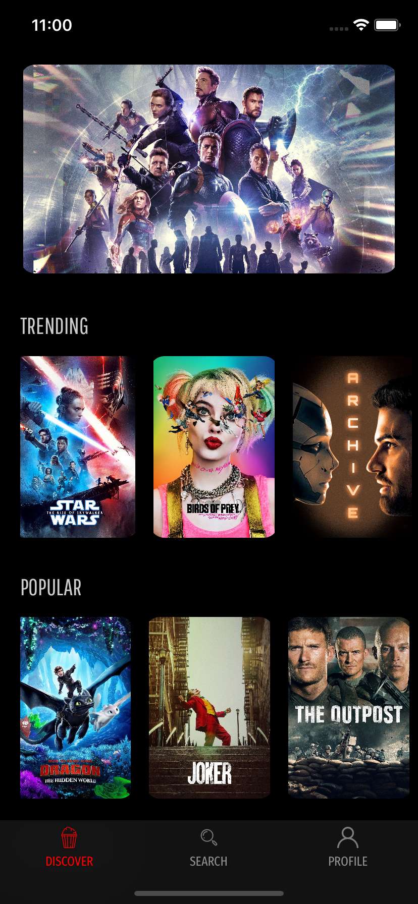

# PressPlay

A full stack app that uses the Movie Database API to parse through thousands of movies, uses Firebase Database to save movie details and Firebase Storage to store images. 

### Technologies Used:

* UIKit
* MovieDB API
* Firebase
* Kingfisher
* DZNEmptyDataSet

### Features:

* Create user profiles.
* Get details for thousands of movies on the MovieDB API.
* Browse through movies based on poularity, trending etc.
* Search for a specific movie.
* Save movies to your profile.

### Screenshots:

 
 
